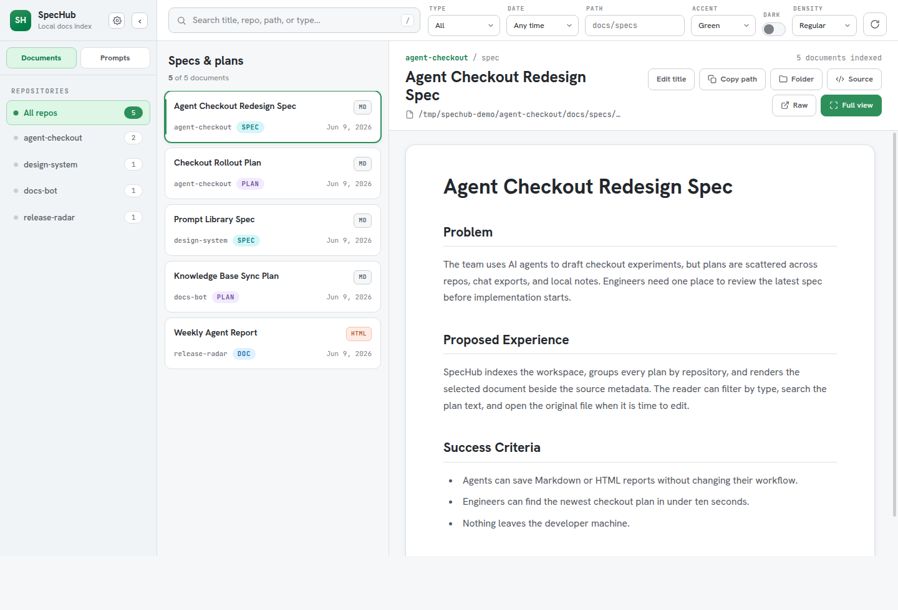
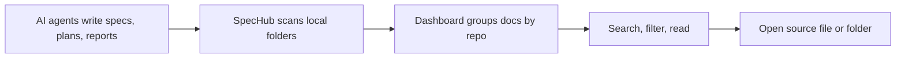

# SpecHub

**A local dashboard for the specs, plans, and HTML reports your AI agents leave across your machine.**

SpecHub scans your workspaces, groups agent output by repository, renders Markdown safely, previews HTML artifacts, and lets you jump back to the original file. No upload. No hosted account. Just a fast local index for agent-driven work.



## Why Use It

- Find specs and implementation plans across many repos without remembering where an agent saved them.
- Read Markdown and sandboxed HTML reports in one browser UI.
- Filter by repo, type, path, date, and text when your agent output gets noisy.
- Keep everything local on disk.

## Install

```sh
curl -fsSL https://raw.githubusercontent.com/voxuanthuan/spechub/main/install.sh | sh
```

## Use

```sh
spechub --open
```

Scan specific workspaces:

```sh
spechub --roots ~/workspace ~/projects --open
```

SpecHub prints a local URL like `http://127.0.0.1:43210`.

## How It Works



SpecHub looks for common files such as:

- `docs/**/*.{md,markdown,html}`
- `docs/specs/**/*.{md,html}`
- `docs/plans/**/*.md`
- `specs/**/*.{md,html}`
- `Spec.md`, `spec.md`, `plan.md`
- OpenCode plan sessions from `~/.local/share/opencode`

## Configure

Optional config lives at:

```txt
~/.config/spechub/config.json
```

Minimal example:

```json
{
  "roots": ["~/workspace"],
  "ignorePatterns": [".git", "node_modules", "dist", "build", ".next"],
  "titleOverrides": {
    "~/workspace/my-repo/docs/specs/api.md": "API Redesign Spec"
  }
}
```

## Develop

```sh
pnpm install
pnpm build
pnpm dev:browser
```

Run checks:

```sh
pnpm typecheck
pnpm test
pnpm build
```

## Local First

SpecHub serves a dashboard from your own machine and reads files already on your disk. It is built for developers using Codex, Claude Code, OpenCode, and other AI agents that generate lots of planning artifacts across many repositories.
