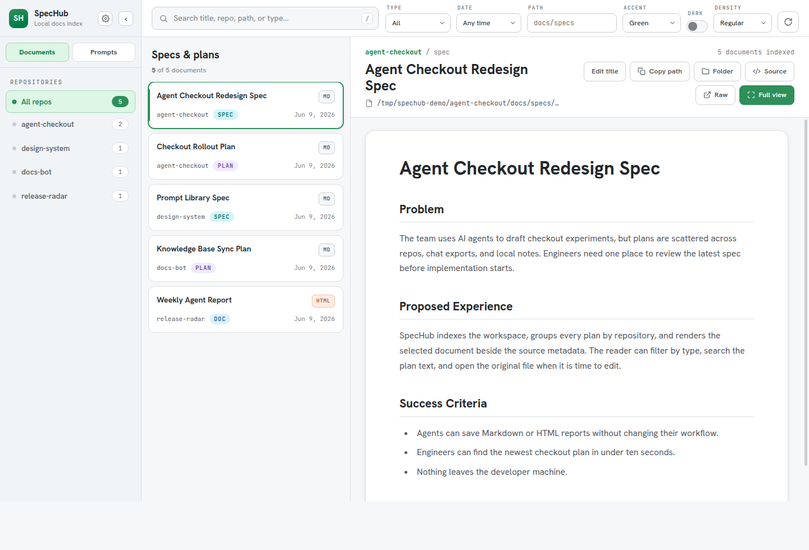
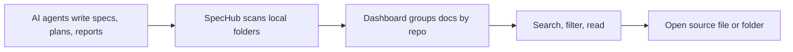

# SpecHub

**A local dashboard for the specs, plans, and HTML reports your AI agents leave across your machine.**
*Inspired by [The Unreasonable Effectiveness of HTML](https://thariqs.github.io/html-effectiveness/).*

SpecHub scans your workspaces, groups agent output by repository, renders Markdown safely, previews HTML artifacts, and lets you jump back to the original file. No upload. No hosted account. Just a fast local index for agent-driven work.



## Inspired by *The Unreasonable Effectiveness of HTML*

[thariqs.github.io/html-effectiveness](https://thariqs.github.io/html-effectiveness/) argues that AI agents should ship `.html` files — annotated diffs, status reports, design swatches, slide decks, post-mortem timelines — instead of long Markdown. HTML is the medium your browser, design system, and prototypes already live in, so the artifact is also the rendering.

SpecHub is built on the same premise. It indexes both `.md` and `.html` artifacts your agents produce and renders them in one local dashboard. Tell your agent "ship an HTML report" or "ship a Markdown spec" — SpecHub finds it either way.

## Why Use It

- Find specs and implementation plans across many repos without remembering where an agent saved them.
- Read Markdown and sandboxed HTML reports in one browser UI.
- Filter by repo, type, path, date, and text when your agent output gets noisy.
- Renders HTML reports your agents ship — not just Markdown — because HTML is the most effective artifact an agent can produce.
- Keep everything local on disk.

## Install

```sh
curl -fsSL https://raw.githubusercontent.com/voxuanthuan/spechub/main/install.sh | sh
```

## Update

Once installed, pull the latest version and rebuild in place — no need to re-run the install script:

```sh
spechub update
```

## Use

```sh
spechub --open
```

Scan specific workspaces:

```sh
spechub --roots ~/workspace ~/projects --open
```

SpecHub prints a local URL like `http://127.0.0.1:43210`.

## How It Works


```mermaid
flowchart LR
  A[AI agents write specs, plans, reports] --> B[SpecHub scans local folders]
  B --> C[Dashboard groups docs by repo]
  C --> D[Search, filter, read]
  D --> E[Open source file or folder]
```

SpecHub looks for common files such as:

- `docs/**/*.{md,markdown,html}`
- `docs/specs/**/*.{md,html}`
- `docs/plans/**/*.md`
- `specs/**/*.{md,html}`
- `Spec.md`, `spec.md`, `plan.md`
- OpenCode plan sessions from `~/.local/share/opencode`
- Git worktrees under `~/.herdr/worktrees/<repo>/<branch>` — every worktree's specs and plans are grouped under the original `<repo>`
- Claude Code worktrees nested at `<repo>/.claude/worktrees/<value>/` — their specs and plans are grouped under the original `<repo>`

## Configure

Optional config lives at:

```txt
~/.config/spechub/config.json
```

Minimal example:

```json
{
  "roots": ["~/workspace"],
  "ignorePatterns": [".git", "node_modules", "dist", "build", ".next"],
  "titleOverrides": {
    "~/workspace/my-repo/docs/specs/api.md": "API Redesign Spec"
  }
}
```

## Develop

```sh
pnpm install
pnpm build
pnpm dev:browser
```

Run checks:

```sh
pnpm typecheck
pnpm test
pnpm build
```

## Desktop App

SpecHub ships a native desktop app (Tauri) for macOS, Linux, and Windows. It shares the same
dashboard UI as the web version and the same config, state, and annotation files under
`~/.config/spechub/`, so you can switch between them freely.

Run it in development:

```sh
pnpm dev:desktop
```

Build installers for the current OS (Linux → `.deb`/`.rpm`/AppImage, macOS → `.app`/`.dmg`,
Windows → `.msi`/`.nsis`):

```sh
pnpm build:desktop
```

Bundles land in `src-tauri/target/release/bundle/`. Tagged releases (`v*`) build all platforms in
CI and attach the installers to a draft GitHub release.

**Prerequisites**

- **Linux:** WebKitGTK 4.1 and GTK dev libraries — on Debian/Ubuntu:
  `sudo apt-get install libwebkit2gtk-4.1-dev libgtk-3-dev libayatana-appindicator3-dev librsvg2-dev patchelf file libxdo-dev libssl-dev`.
- **macOS / Windows:** no extra system packages. The Windows installer bootstraps the WebView2
  runtime automatically.

**Unsigned builds**

The published installers are not code-signed yet. On macOS, right-click the app and choose **Open**
on first launch (or run `xattr -cr /Applications/SpecHub.app`). On Windows, if SmartScreen warns,
choose **More info → Run anyway**.

## Local First

SpecHub serves a dashboard from your own machine and reads files already on your disk. It is built for developers using Codex, Claude Code, OpenCode, and other AI agents that generate lots of planning artifacts across many repositories.
